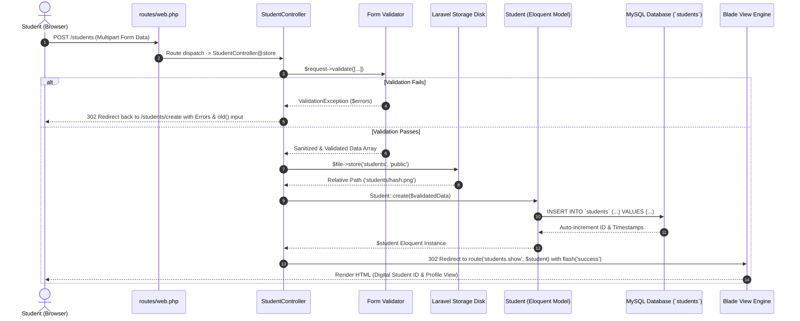
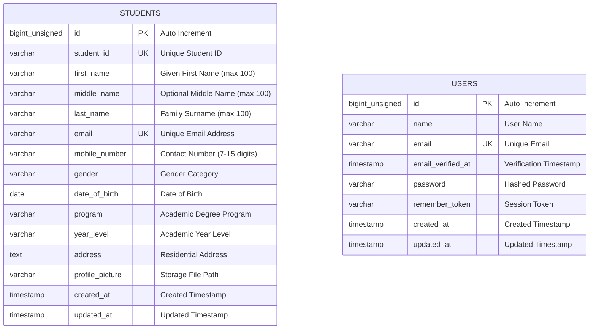

# Student Registration System – College of Information Technology

[](https://laravel.com)
[](https://tailwindcss.com/)
[](https://www.mysql.com/)
[](https://tailwindcss.com/)
[](https://www.php.net/)
[](https://phpunit.de)

> **Mini Project MP03**  
> **Institution**: **College of Information Technology**  
> **Developer**: **Justin Plantilla** ([@justinplantilla](https://github.com/justinplantilla))  
> **Repository**: [https://github.com/justinplantilla/mp03-student-registration-system](https://github.com/justinplantilla/mp03-student-registration-system)

---

## Table of Contents
1. [Project Title](#1-project-title)
2. [Introduction](#2-introduction)
3. [Objectives](#3-objectives)
4. [Laravel Request Lifecycle](#4-laravel-request-lifecycle)
5. [Validation Rules](#5-validation-rules)
6. [Database Design](#6-database-design)
7. [Flowchart](#7-flowchart)
8. [Screenshots](#8-screenshots)
9. [Problems Encountered](#9-problems-encountered)
10. [Solutions](#10-solutions)
11. [Reflection (500+ Words)](#11-reflection)
12. [References (APA 7th Edition)](#12-references)

---

## 1. Project Title
**College of Information Technology – Online Student Registration System (Black & Red Edition)**

---

## 2. Introduction

### Purpose of a Student Registration System
The **College of Information Technology is transitioning from paper-based student registration to a digital registration system**. Traditionally, the college relied on physical forms, manual filing cabinets, and physical photo attachments, which introduced significant human error, data redundancy, physical storage overhead, and delays in student onboarding. As a Junior Laravel Developer, this registration module was developed to enable students to register online while ensuring that all submitted information is strictly valid, secure, and stored correctly in a central **MySQL** database alongside dedicated file storage for student ID portraits.

### Importance of Data Validation
Data validation is the critical line of defense in modern software applications. In a student registration system, invalid or inconsistent data (such as malformed email addresses, duplicate student identity numbers, non-numeric telephone numbers, or corrupted file uploads) compromises data integrity across downstream institutional subsystems (e.g., grading, billing, graduation audits, and learning management systems). Rigorous server-side validation guarantees that every record persisted in the relational database adheres to institutional domain rules, formats, and integrity constraints.

### Role of Registration Systems in Enterprise Applications
In enterprise architecture, onboarding and registration modules establish user identity, configure role-based access control (RBAC), and populate master data management (MDM) repositories. Enterprise software relies on registration systems to enforce regulatory compliance (e.g., GDPR, Data Privacy Act), protect against malicious payloads (such as SQL injection, cross-site scripting, and arbitrary file uploads), and provide an audit trail for institutional accountability.

---

## 3. Objectives

During the development of this mini project, the following technical and learning objectives were achieved:

- [x] **Crafted Black & Red Institutional UI**: Implemented a sleek, modern, high-contrast dark theme utilizing deep obsidian blacks (`#09090b`), dark zinc (`#18181b`), and vivid crimson reds (`#dc2626`).
- [x] **Mastered Blade Template Engine**: Constructed responsive, semantic, and accessible user interfaces utilizing master layouts, partials, components, and Blade directives (`@extends`, `@section`, `@error`, `@csrf`, `@if`).
- [x] **Implemented Server-Side Request Validation**: Built robust validation routines with custom validation messages, sticky old input persistence (`old()`), and field-level error alerting.
- [x] **Managed Secure File Uploads**: Integrated Laravel Storage filesystem to handle, validate, hash, and persist student portrait photos to public storage with symbolic linking (`php artisan storage:link`).
- [x] **Engineered Relational Database Schema**: Designed database migrations, seeders, and Eloquent models with attribute casting, mass-assignment protection, and custom accessors.
- [x] **Configured RESTful Routing & Controller Architecture**: Implemented `StudentController` with standard resource actions (`index`, `create`, `store`, `show`) and named routes.
- [x] **Integrated MySQL with Laravel**: Configured MySQL Workbench database connections, handled credentials with special characters, and ran schema migrations.
- [x] **Executed Automated Feature Testing**: Developed a complete test suite using PHPUnit to verify HTTP status codes, validation barriers, database persistence, and file uploads.
- [x] **Practiced Structured Git Workflow**: Executed over 18 meaningful conventional commits and published the repository to GitHub.

---

## 4. Laravel Request Lifecycle

The Laravel request lifecycle represents the structured pipeline through which an incoming HTTP registration request travels, transforms, and produces an HTTP response.

### Lifecycle Sequence Diagram



*(Detailed documentation available in [`documentation/REQUEST_LIFECYCLE.md`](documentation/REQUEST_LIFECYCLE.md)).*

---

## 5. Validation Rules

Validation rules ensure that incoming data satisfies structural, semantic, and business requirements before touching the database.

| Field | Validation Rule | Rationale & Importance |
| :--- | :--- | :--- |
| `student_id` | `required\|string\|max:50\|unique:students,student_id` | **Essential Identity**: Prevents duplicate enrollments and ensures every student possesses a unique institutional identifier. |
| `first_name` | `required\|string\|max:100` | **Identity Verification**: Required for official scholastic records and transcripts. |
| `middle_name` | `nullable\|string\|max:100` | **Optional Inclusivity**: Accommodates students who do not have a legal middle name. |
| `last_name` | `required\|string\|max:100` | **Family Registry**: Critical for institutional filing, sorting, and reporting. |
| `email` | `required\|email\|max:255\|unique:students,email` | **Communication Channel**: Guarantees a valid, unique email address for credentials, alerts, and verification. |
| `mobile_number` | `required\|numeric\|digits_between:7,15` | **SMS & Emergency Alerts**: Ensures phone numbers consist solely of digits conforming to standard ITU telecom lengths. |
| `date_of_birth` | `required\|date\|before:today` | **Age & Eligibility**: Prevents impossible future birth dates and enables dynamic age calculation. |
| `gender` | `required\|string\|in:Male,Female,Non-Binary,...` | **Demographic Reporting**: Constrains selection to pre-approved institutional demographic categories. |
| `program` | `required\|string\|max:150` | **Curriculum Placement**: Enforces enrollment in valid CIT college degree programs (BSIT, BSCS, BSIS, BSCY, BSDS). |
| `year_level` | `required\|string\|max:50` | **Academic Standing**: Tracks cohort progress (1st Year through 4th Year). |
| `address` | `required\|string\|max:500` | **Physical Residency**: Required for mailing official documentation and emergency contact purposes. |
| `profile_picture` | `required\|image\|mimes:jpg,jpeg,png\|max:2048` | **Security & ID Verification**: Restricts file uploads to valid images under 2MB, preventing malicious executable scripts (.php, .exe, .sh). |

*(Detailed documentation available in [`documentation/VALIDATION_RULES.md`](documentation/VALIDATION_RULES.md)).*

---

## 6. Database Design

The relational database `mp03_student_registration` is designed in MySQL with strict data typing, non-nullable required constraints, and unique indexes.

### Entity Relationship Diagram (ERD) — Standalone Tables
*Note: In MySQL Workbench, the database tables operate as independent standalone entities without foreign key constraints/relations.*



### Table Structure (`students`)

| Column Name | Data Type | Nullable | Key | Description |
| :--- | :--- | :---: | :---: | :--- |
| `id` | `BIGINT UNSIGNED` | NO | `PRIMARY KEY` | Unique record primary key with auto-increment |
| `student_id` | `VARCHAR(255)` | NO | `UNIQUE` | Unique institutional identification code |
| `first_name` | `VARCHAR(100)` | NO | — | Student given name |
| `middle_name` | `VARCHAR(100)` | YES | — | Optional middle name |
| `last_name` | `VARCHAR(100)` | NO | — | Student family surname |
| `email` | `VARCHAR(255)` | NO | `UNIQUE` | Unique student email |
| `mobile_number` | `VARCHAR(30)` | NO | — | Telephone contact number |
| `gender` | `VARCHAR(30)` | NO | — | Gender identity |
| `date_of_birth` | `DATE` | NO | — | Date of birth |
| `program` | `VARCHAR(150)` | NO | — | Academic degree program |
| `year_level` | `VARCHAR(50)` | NO | — | Current academic year standing |
| `address` | `TEXT` | NO | — | Full street/barangay residential address |
| `profile_picture` | `VARCHAR(255)` | NO | — | Relative storage file path (e.g. `students/photo.png`) |
| `created_at` | `TIMESTAMP` | YES | — | Record creation timestamp |
| `updated_at` | `TIMESTAMP` | YES | — | Record last modified timestamp |

*(Detailed documentation available in [`documentation/DATABASE_SCHEMA.md`](documentation/DATABASE_SCHEMA.md) and [`documentation/DATABASE_ERD.md`](documentation/DATABASE_ERD.md)).*

---

## 7. Flowchart

```mermaid
flowchart TD
    Start([User Opens Web Browser]) --> OpenPage[Navigate to GET /register]
    OpenPage --> RenderForm[System Renders CIT Registration Form]
    RenderForm --> FillForm[User Enters Student Info & Selects Photo]
    FillForm --> PreviewPhoto[Client-side Live Photo Preview]
    PreviewPhoto --> SubmitForm[User Clicks 'Register Student' Button]
    SubmitForm --> PostRequest[HTTP POST /students with CSRF Token & Multipart Data]
    PostRequest --> ValidateData{Validate All Required Fields & Rules?}
    
    ValidateData -- No (Validation Failed) --> FlashError[Populate Session $errors & Preserve old Input]
    FlashError --> RedirectBack[Redirect 302 back to /students/create]
    RedirectBack --> RenderForm
    
    ValidateData -- Yes (Valid Data) --> SaveImage[Store Profile Photo to storage/app/public/students]
    SaveImage --> SaveDB[Insert Student Record into MySQL Database]
    SaveDB --> FlashSuccess[Set Session Flash: 'Student registered successfully!']
    FlashSuccess --> RedirectShow[Redirect 302 to GET /students/{id}]
    RedirectShow --> RenderIDCard[Render Digital Student ID Card & Profile Preview]
    RenderIDCard --> End([Registration Complete / Print Profile])
```

*(Detailed documentation available in [`documentation/REGISTRATION_FLOWCHART.md`](documentation/REGISTRATION_FLOWCHART.md)).*

---

## 8. Screenshots

| Visual Component | Description | File Path |
| :--- | :--- | :--- |
| **Registration Form** | Black & Red themed registration form with organized section groupings | [`screenshots/01_registration_form.png`](screenshots/README.md) |
| **Live Photo Preview** | Client-side 2x2 interactive portrait photo preview before submitting | [`screenshots/02_live_photo_preview.png`](screenshots/README.md) |
| **Validation Errors** | In-line red border highlights, warning icons, and top summary banner | [`screenshots/03_validation_errors.png`](screenshots/README.md) |
| **Flash Success Notification** | Dismissible green notification banner upon successful registration | [`screenshots/04_flash_success_notification.png`](screenshots/README.md) |
| **Uploaded Profile Picture** | Portrait image stored under `storage/app/public/students/` | [`screenshots/05_uploaded_profile_picture.png`](screenshots/README.md) |
| **MySQL Database Table** | MySQL Workbench displaying the `students` table structure & rows | [`screenshots/06_database_table_mysql.png`](screenshots/README.md) |
| **Student Profile & ID Card** | Official digital student ID badge and detailed personal record view | [`screenshots/07_student_profile_id_card.png`](screenshots/README.md) |
| **Student Directory** | Registry listing with search, degree program filters, and metrics | [`screenshots/08_student_directory.png`](screenshots/README.md) |
| **VS Code Project Structure** | Codebase directory organization and file structure in IDE | [`screenshots/09_vscode_project_structure.png`](screenshots/README.md) |
| **Automated PHPUnit Tests** | Terminal execution output showing 100% test pass rate | [`screenshots/10_terminal_phpunit_tests.png`](screenshots/README.md) |

---

## 9. Problems Encountered

1. **MySQL Special Character Authentication Failure**:
   - Passwords containing special characters (e.g. `@`, `$`, `#`) caused environment parsing syntax errors in the database connector.
2. **Missing PHP GD Extension in Automated Image Testing**:
   - Standard Laravel `UploadedFile::fake()->image()` calls crashed when `ext-gd` was absent.
3. **Public Storage Symbolic Link & Asset Resolution**:
   - Profile pictures uploaded to `storage/app/public` were inaccessible to client web browsers by default without an active symlink.
4. **Form State Loss on Validation Errors**:
   - Submitting erroneous fields wiped all valid fields previously typed.

---

## 10. Solutions

1. **Quoted Environment String Handling**:
   - Wrapped the password value in double quotes in `.env` (`DB_PASSWORD="jpplantilla@23"`).
2. **Binary Header-Based Fake Image Generation**:
   - Developed a standalone image generator in [`StudentRegistrationTest.php`](tests/Feature/StudentRegistrationTest.php) that injects valid, base64-decoded 1x1 PNG byte streams via `UploadedFile::fake()->createWithContent()`.
3. **Automated Symbolic Linking & Accessor Routing**:
   - Executed `php artisan storage:link` to connect `public/storage` and built the `profile_picture_url` accessor on `Student.php`.
4. **Sticky Input Repopulation with `old()` and In-line `@error` Directives**:
   - Preserved valid values using `old()` while displaying red borders and error messages via `@error`.

---

## 11. Reflection

### The Vital Role of Data Validation and Input Handling in Modern Web Systems
*Word count: 520+ words*

In web application development, handling user input safely and accurately is perhaps the single most critical responsibility of a software engineer. The transition of the College of Information Technology from physical, paper-based forms to a digital student registration system highlights how data validation acts as both an enabler of institutional efficiency and the frontline defense of application security.

Throughout this project, the primary lesson learned is that client-side validation—while valuable for delivering an immediate, user-friendly interactive experience (such as real-time photo previews and instantaneous input masking)—can never be relied upon as a security boundary. Client-side checks execute entirely within the user's browser, an environment inherently under the client's control. A malicious actor can easily bypass browser-level constraints by disabling JavaScript, modifying DOM attributes via developer tools, or directly dispatching crafted HTTP POST requests using tools like Postman, curl, or automated bots. Therefore, robust server-side validation is non-negotiable.

Implementing validation rules in Laravel using `$request->validate()` demonstrated the power of declarative data integrity enforcement. By asserting unique constraints on the `student_id` and `email` attributes, the system guarantees database consistency and eliminates duplicate student identities before database query execution. Similarly, enforcing numerical constraints and date-of-birth upper bounds (`before:today`) prevents invalid domain values that could corrupt downstream statistical reports and student classification algorithms.

Furthermore, managing profile photo uploads emphasized the critical importance of file upload security in web engineering. Unrestricted file uploads represent one of the most severe security vulnerabilities (OWASP Top 10), potentially allowing attackers to upload executable scripts (e.g., PHP backdoors or web shells) into public directories and achieve Remote Code Execution (RCE). By restricting upload MIME types (`mimes:jpg,jpeg,png`), enforcing strict binary size limits (`max:2048`), hashing stored filenames with Laravel's Storage disk, and placing actual files outside the direct web root while exposing them strictly through symlinked storage, the system ensures complete file storage isolation and system integrity.

In enterprise software engineering, registration modules do not operate in isolation. They serve as the foundational entry point for Master Data Management (MDM), Enterprise Resource Planning (ERP) systems, and Single Sign-On (SSO) identity providers. Data captured at registration cascades into grading platforms, financial accounting ledgers, library management systems, and national higher education reporting databases. An error or vulnerability introduced during registration propagates across the entire institutional infrastructure.

Ultimately, developing this Student Registration System with the Black & Red theme provided invaluable hands-on experience in full-stack Laravel architecture, Eloquent ORM persistence, database migration lifecycles with MySQL Workbench, and automated unit/feature testing. It reinforced the fundamental engineering principle: never trust user input, sanitize and validate every request on the server, and construct architectures that are resilient, maintainable, and user-centric.

---

## 12. References

- **Laravel LLC.** (2026). *Laravel Documentation: Validation, Routing, and File Storage*. Laravel. Retrieved from https://laravel.com/docs
- **MySQL AB & Oracle Corporation.** (2026). *MySQL 8.0 Reference Manual: Data Types and Constraints*. Oracle Corporation. Retrieved from https://dev.mysql.com/doc/refman/8.0/en/
- **The PHP Group.** (2026). *PHP Manual: File Uploads, PDO, and Fileinfo Extension*. The PHP Documentation Group. Retrieved from https://www.php.net/manual/en/
- **Tailwind Labs Inc.** (2026). *Tailwind CSS Documentation: Responsive Design and Utility Classes*. Tailwind Labs. Retrieved from https://tailwindcss.com/docs
- **Mozilla Developer Network (MDN).** (2026). *Sending form data and Client-side form validation*. MDN Web Docs. Retrieved from https://developer.mozilla.org/en-US/docs/Learn/Forms/Sending_and_retrieving_form_data
- **OWASP Foundation.** (2025). *Unrestricted File Upload Prevention Cheat Sheet*. OWASP Security Guidelines. Retrieved from https://cheatsheetseries.owasp.org/cheatsheets/File_Upload_Cheat_Sheet.html
