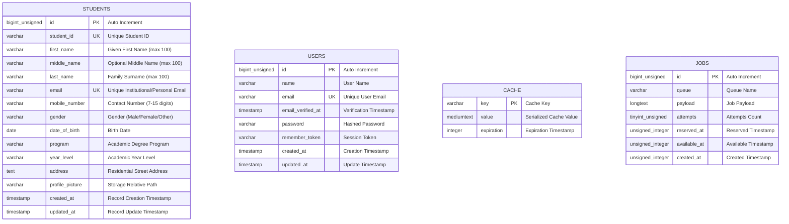

# Database Entity Relationship Diagram (ERD)

This document visualizes the table schemas within the `mp03_student_registration` MySQL database. As per the system architecture, the tables operate as **independent, standalone entities without foreign key constraints/relations**.

## Entity Relationship Diagram (Standalone Tables)

---

## Architectural Note on Database Relations

In this registration module:
- The **`students`** table functions as a self-contained, standalone entity holding all required personal, academic, contact, and portrait path data.
- No foreign key relationships or join constraints are enforced between `students` and other system tables (`users`, `cache`, `jobs`), ensuring maximum performance, modularity, and simplified data lifecycle management in MySQL Workbench.
