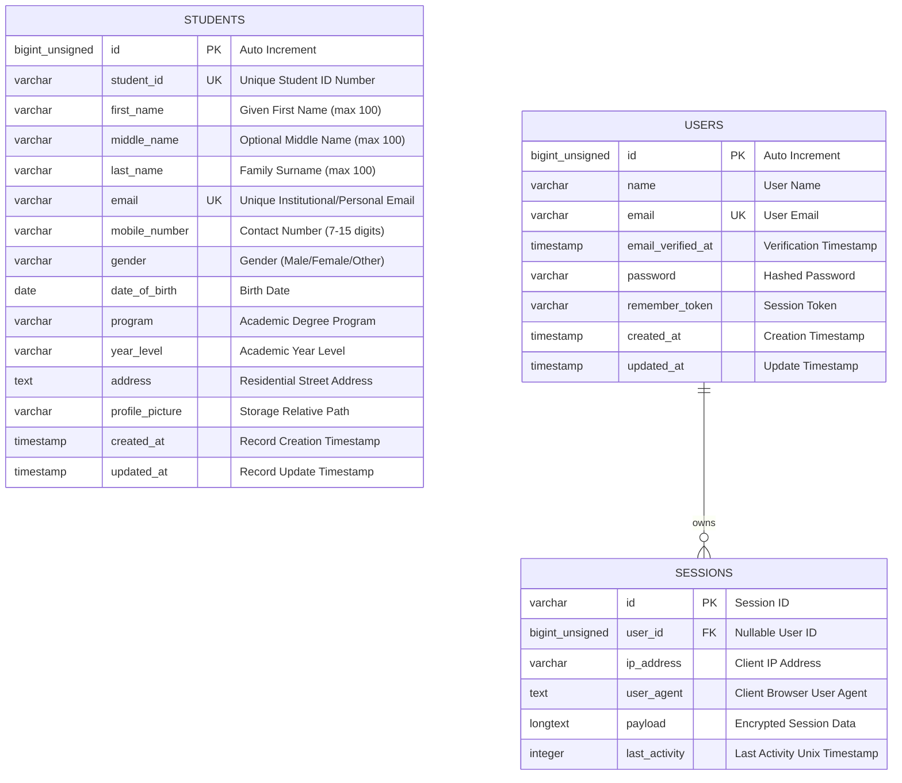

# Database Entity Relationship Diagram (ERD)

This document visualizes the database structure and relational entities within the `mp03_student_registration` database.

## Entity Relationship Diagram

---

## Field Specifications & Keys

- **Primary Key (`PK`)**: `students.id` uniquely indexes each record.
- **Unique Keys (`UK`)**:
  - `students.student_id`: Prevents duplicate enrollment records.
  - `students.email`: Enforces email uniqueness across all students.
- **Storage Path**: `students.profile_picture` references the file saved under `storage/app/public/students/`.
