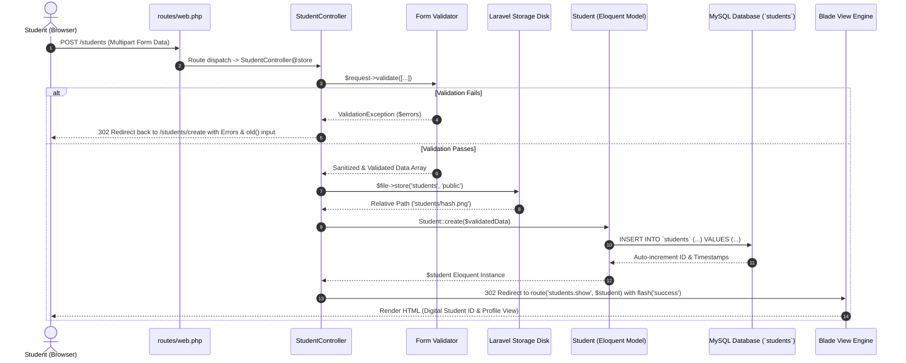

# Laravel Request Lifecycle Diagram

This document details how an HTTP request for student registration moves through the Laravel framework.

## Lifecycle Diagram

---

## Step-by-Step Explanation

1. **Browser (Client Request)**:
   - The student fills out the registration form in `students/create.blade.php` and submits multipart form data containing textual data and the profile photo file.
2. **Routing Layer (`routes/web.php`)**:
   - The request hits `POST /students`, matched against the named route `students.store`, invoking `StudentController@store`.
3. **Controller (`StudentController@store`)**:
   - Receives the incoming `Illuminate\Http\Request` instance.
4. **Validation Layer**:
   - Executes validation rules against every input. If any rule fails, a `ValidationException` is thrown, halting execution and redirecting back with `$errors` and `old()` inputs.
5. **Storage Subsystem**:
   - Upon successful validation, the uploaded image file is hashed and saved under `storage/app/public/students/`.
6. **Eloquent Model (`Student.php`)**:
   - The validated attributes and image path are mass-assigned to the `Student` model.
7. **MySQL Database**:
   - Eloquent generates a parameterized `INSERT` query into the `students` table.
8. **HTTP Response & Blade Engine**:
   - Controller redirects to `students.show` with flash session data. The Blade engine renders the student's profile and digital ID badge.
